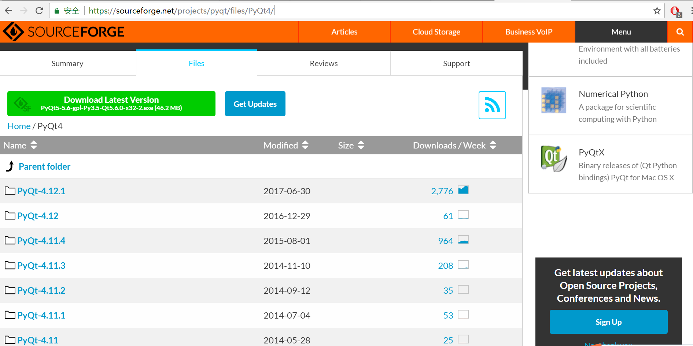
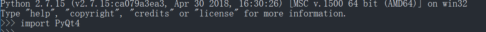

### 在WIN10环境下配置PyQt4
#### Author: liu.sy.chn@hotmail.com

#### INTRODCUTION
因为遇到一些小任务，需完成一个软件的前后端的工作，而此软件由Python编写，故很自然地想到使用PyQt进行GUI的编写工作。Python2.7环境下，PyQt4是完美适配的，
所以最终选择PyQt4的配置。

#### NECESSARIES
1.Python2.7  
2.PyQt4  

#### STEPS
1.在官网下载python安装程序并安装。  
2.下载[PyQt4](https://sourceforge.net/projects/pyqt/files/PyQt4/)安装程序，注意看清支持的Python版本与系统位数。

上图即为WSL安装配置成功后的界面。
3.按向导步骤进行安装即可。

#### CHECK
启动Python后，如下图所示，导入成功即可。

上图即为WSL安装配置成功后的界面。
